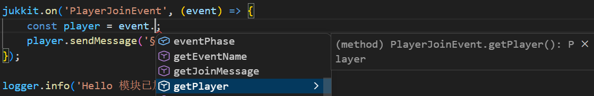

# Jukkit

**Jukkit** 是一个用于使用 JavaScript 开发 Minecraft 服务器插件的框架。

## 特性

- **无需 Java 环境** - 仅需 JavaScript 即可开发插件
- **现代语法支持** - 内置 Rspack + Babel，支持完整的 ES6+ 语法
- **Dev 模式** - 开发时支持热重载，无需重复部署 JAR
- **TypeScript 类型支持** - 拥有较为完整的类型定义，支持编辑器代码补全
- **可选 TypeScript 编译** - 支持使用 TypeScript 编写插件，类型安全
- **产物为标准 JAR** - 生成的 JAR 文件可直接加载到 Minecraft 服务器
- **远程部署** - 支持 MCSManager 自动上传
- **多目标编译** - 支持 Standalone 和 Common 两种版本，按需选择



## 文档

- **[快速开始](./docs/快速开始.md)** - 快速上手 Jukkit 开发
- **[进阶知识](./docs/进阶知识.md)** - 深入了解构建配置、init 机制、模块系统等
- **[API 文档](./docs/API.md)** - 完整的 Jukkit API 参考
- **[库模块文档](./docs/LIBS.md)** - 内置库模块详细文档

## 快速预览

```javascript
// src/index.js
jukkit.onEnable(() => {
    // 注册命令
    jukkit.command('hello', (sender) => {
        sender.sendMessage('§aHello, ' + sender.getName() + '!');
        return true;
    });

    // 监听事件
    jukkit.on('PlayerJoinEvent', (event) => {
        event.getPlayer().sendMessage('§e欢迎来到服务器!');
    });

    return true;
});
```

## 环境要求

- Node.js 16+
- Minecraft 服务器（支持 Bukkit/Spigot/Paper 等）

## 安装

```bash
git clone https://github.com/iYeXin/Jukkit.git
cd Jukkit
npm install
```

## 版本选择

Jukkit 1.3.0+ 提供两种编译目标：

### Common 版本（推荐）

- ✅ 支持 Vert.x 网络库
- ✅ 多插件共享依赖，总体积更小
- ✅ 未来支持 Node.js 核心模块和 npm 生态
- ⚠️ 需要 Jukkit-Common 前置插件

### Standalone 版本（不推荐）

- ✅ 内嵌 Nashorn JavaScript 引擎
- ✅ 无需任何前置插件
- ❌ 不支持 Vert.x
- ❌ 不支持 Node.js 核心模块和 npm 生态
- ⚠️ 未来不会添加新功能

### 体积对比

| 组件                   | 大小                          |
| ---------------------- | ----------------------------- |
| Jukkit-Common 前置插件 | ~8.5 MB                       |
| Standalone 方案插件    | ~2.5 MB                       |
| Common 方案插件        | > 0.05 MB（取决于项目复杂度） |

> **建议**：对于新项目，推荐使用 Common 版本。Standalone 版本适合简单场景或不想安装前置插件的情况。

在 `jukkit.config.js` 中配置：

```javascript
project: {
    target: 'common'  // 或 'standalone'，或 ['standalone', 'common'] 同时编译
}
```

## 前置插件（仅 Common 版本需要）

如果使用 Common 版本，需要将 `jukkit-common-1.3.0.jar` 放入服务器的 `plugins` 目录。

> Jukkit-Common 提供了 Nashorn JavaScript 引擎和 Vert.x 的共享实例，多个 Jukkit 插件可以共用同一份依赖，大幅减少总体积。

## 开发流程

1. 修改 `jukkit.config.js` 配置插件信息
2. 在 `src/` 目录下编写代码
3. 运行 `npm run build` 构建
4. 部署生成的 JAR 文件到服务器

详细步骤请参阅 [快速开始](./docs/快速开始.md)。

## 项目结构

```
Jukkit/
├── init/                 # 初始化脚本（无需修改）
├── modules/              # 模块目录（可直接 require 引入）
├── src/
│   ├── index.js          # 入口文件
│   └── assets/           # 资源目录
├── types/                # TypeScript 类型定义
├── docs/                 # 文档
└── jukkit.config.js      # 项目配置
```

## 内置库模块

| 模块     | 说明                       |
| -------- | -------------------------- |
| `fs`     | 文件系统（读写、监听、流） |
| `http`   | HTTP 服务器                |
| `fetch`  | HTTP 请求                  |
| `Logger` | 日志工具类                 |

详见 [库模块文档](./docs/LIBS.md)。

## TODO

- 使用 Vert.x 提供 Node.js 核心模块兼容层，以支持 npm 生态
- 支持 source map
- 迁移至其他 JS 引擎

## 相关项目

- **Jukkit-Common** - 前置插件，提供 Nashorn 引擎和 Vert.x 的共享实例（仅 Common 版本需要）
- **Jukkit-Template** - JAR 模板项目，包含 Java 运行时类

## 致谢

本项目的理念源于 **OpenJavascript** 插件（https://gitlab.com/spidermodders/openjs），这是一个允许运行 JavaScript 脚本以控制服务器插件。

## 许可证

MIT License
